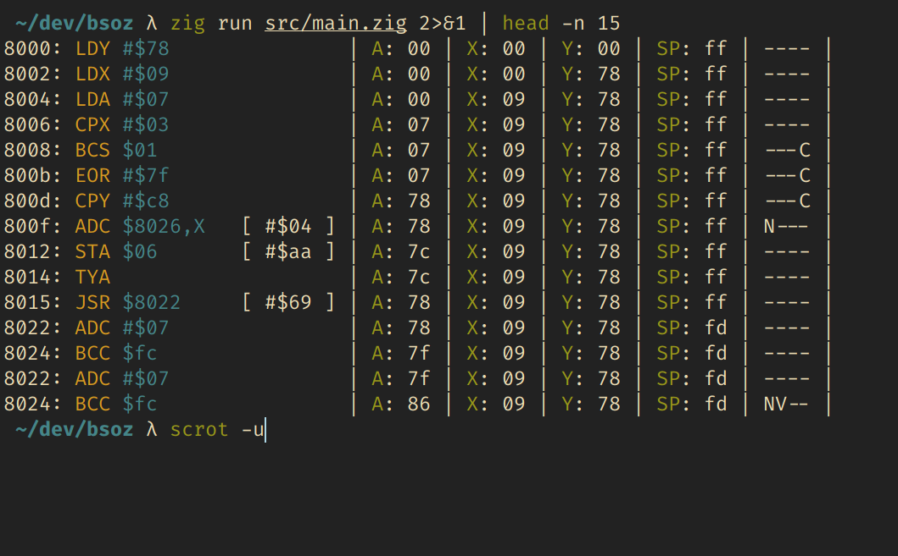

# bso-z: a 6502 virtual machine

Reads and runs assembled [6502](https://en.wikipedia.org/wiki/MOS_Technology_6502) machine code, instruction by instruction. Prints out disassembly information and register status on the fly.



## To do
- Implement rest of operations
- Run more test programs
- Figure out interrupts
- Proper CLI interface
- Factor out disassembler as separate module
- Do a cool virtual display driver like [skilldrick](https://github.com/skilldrick/6502js) did
- Write the build file

## Make

Dependencies:

- [Zig](https://github.com/ziglang/zig)
- [vasm](http://sun.hasenbraten.de/vasm/index.php?view=main)

```sh
vasm6502_oldstyle -Fbin -dotdir -o tests/day.bin tests/day.s
zig run src/main.zig
```
